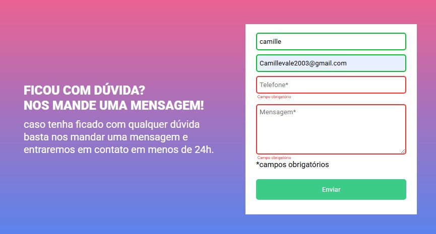

# Quest HTML, CSS, JS intermediário - Desafio - Formulário com validação

Esta é uma solução para a Quest de JS Intermediário.

## Visão geral

### O desafio

- Construir o projeto de acordo com os designs fornecidos

### Screenshot

## Meu processo

### Construído com

- Semantic HTML5 
- CSS custom properties
- Js intermediario

### O que aprendi

Eu consolidei meus conhecimentos em JS, sendo a primeira vez que uso essa linguagem em um projeto.

### Desenvolvimento contínuo

Planejo continuar focando em desenvolver minhas habilidades em JS.